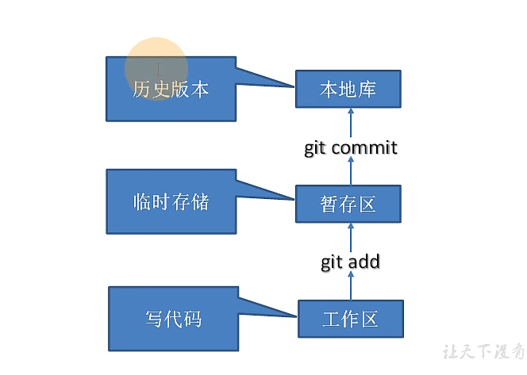
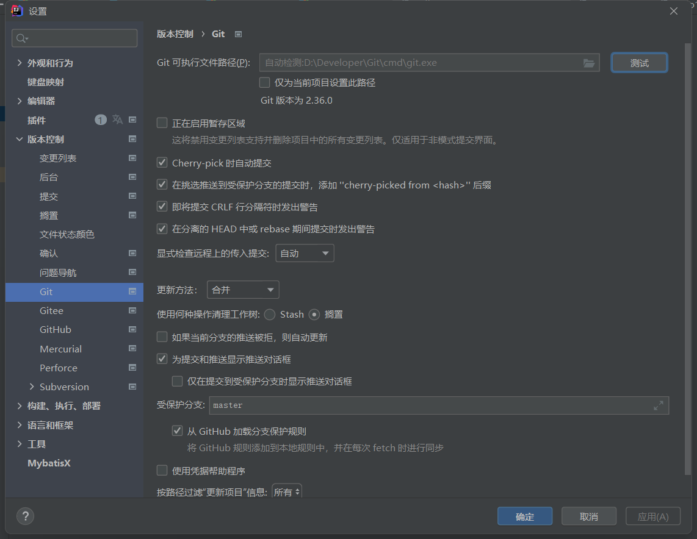
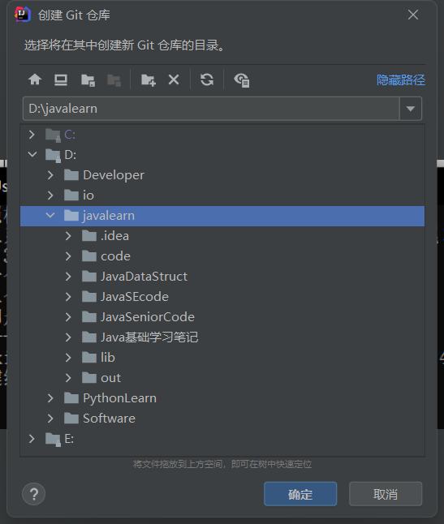
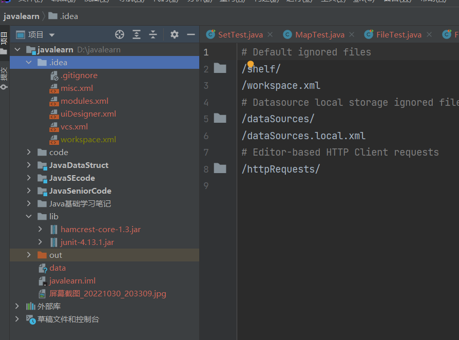

# Git概述
  ## Git特点：
  - 免费 开源 
  - 分布式版本控制 
  - 易学 性能快 
  - 方便的暂存区域 多个工作流分支 
## 1.1 何为版本控制
版本控制用来记录文件内容变化，便于将来查阅特定版本修改情况的系统。

## 1.2 为什么需要版本控制
从个人开发过渡到团队协作  
多副本不利于团队协作开发，容易被覆盖


## 1.3 版本控制工具
### 1.3.1 集中化版本控制
- 单一集中管理服务器
- 缺点是中央服务器的单点故障 服务器宕机时 所有人无法工作
- 例如SVN

### 1.3.2 分布式版本控制
- 每个人在自己本地做代码库
- 统一的代码托管中心（远程库）轻易不会挂
- 其他人想要代码开发需要拉取最新代码 
- 服务器断网的情况也可以进行开发
- 每个客户端都是完整的项目包含历史记录 发生故障也可以用其他客户端的本地仓库进行恢复

## 1.4 Git发展历史


## 1.5 Git工作机制


- 工作区：代码存放在磁盘的位置
- 暂存区：写了代码，将代码从工作区添加到暂存区（临时存储）代码可以删除
- 本地库：将代码提交到本地库，生成历史版本，代码就删不掉了 


## 1.6 Git和代码托管中心
- 局域网
  - GitLab
- 互联网
  - GitHub
  - Gitee
## 2.1 Git安装
[Git官方]("https://git-scm.com/")  


```
git --version
```

## 3.1 Git常用命令

```
cat ~/.gitconfig     查看本地用户信息
git init       初始化本地库
git status     查看本地库状态
git add  文件名  添加到暂存区
git commit -m "日志信息"  文件名  提交到本地库
git reflog     查看历史记录
git reset --hard 版本号    版本穿梭

```

```shell
查看本地用户信息
guohaibo@DESKTOP-OUANH0A MINGW64 ~
$ cat ~/.gitconfig
[user]
        name = guohaibo
        email = 18403560369@164.com
[http]
        sslVerify = false
```
```
初始化本地库 git init 
guohaibo@DESKTOP-OUANH0A MINGW64 ~/Desktop/GitSpace/Gitdemo
$ git init
Initialized empty Git repository in C:/Users/guohaibo/Desktop/GitSpace/Gitdemo/.git/

查看本地库状态
guohaibo@DESKTOP-OUANH0A MINGW64 ~/Desktop/GitSpace/Gitdemo (master)
$ git status
On branch master

No commits yet

nothing to commit (create/copy files and use "git add" to track)

guohaibo@DESKTOP-OUANH0A MINGW64 ~/Desktop/GitSpace/Gitdemo (master)
$ git status
On branch master

No commits yet

Untracked files: 未被追踪的文件  只是存在于工作区
  (use "git add <file>..." to include in what will be committed)
        hello.txt

nothing added to commit but untracked files present (use "git add" to track)

```
```
git add 添加到暂存区
guohaibo@DESKTOP-OUANH0A MINGW64 ~/Desktop/GitSpace/Gitdemo (master)
$ git add hello.txt
warning: LF will be replaced by CRLF in hello.txt.
The file will have its original line endings in your working directory

guohaibo@DESKTOP-OUANH0A MINGW64 ~/Desktop/GitSpace/Gitdemo (master)
$ git status
On branch master

No commits yet

Changes to be committed:
  (use "git rm --cached <file>..." to unstage)
        new file:   hello.txt

删除暂存区的文件
guohaibo@DESKTOP-OUANH0A MINGW64 ~/Desktop/GitSpace/Gitdemo (master)
$ git rm --cached hello.txt
rm 'hello.txt'

文件依旧在工作区
guohaibo@DESKTOP-OUANH0A MINGW64 ~/Desktop/GitSpace/Gitdemo (master)
$ ll
total 4
-rw-r--r-- 1 guohaibo 197609 990 Nov 22 17:20 hello.txt
```
```
git commit 提交本地库
guohaibo@DESKTOP-OUANH0A MINGW64 ~/Desktop/GitSpace/Gitdemo (master)
$ git commit -m "first commit" hello.txt
warning: LF will be replaced by CRLF in hello.txt.
The file will have its original line endings in your working directory
[master (root-commit) 359d15e] first commit
 1 file changed, 33 insertions(+)
 create mode 100644 hello.txt


guohaibo@DESKTOP-OUANH0A MINGW64 ~/Desktop/GitSpace/Gitdemo (master)
$ git status
On branch master
nothing to commit, working tree clean

guohaibo@DESKTOP-OUANH0A MINGW64 ~/Desktop/GitSpace/Gitdemo (master)
$ git reflog
359d15e (HEAD -> master) HEAD@{0}: commit (initial): first commit
版本号  指针指向master分支                           第一次提交版本的日志信息
前七位

guohaibo@DESKTOP-OUANH0A MINGW64 ~/Desktop/GitSpace/Gitdemo (master)
$ git log
commit 359d15e25f894c0a08bbd8975842efaec772759a (HEAD -> master)
Author: guohaibo <18403560369@164.com>
Date:   Tue Nov 22 17:37:34 2022 +0800

    first commit
```
```
修改文件
guohaibo@DESKTOP-OUANH0A MINGW64 ~/Desktop/GitSpace/Gitdemo (master)
$ vim hello.txt

guohaibo@DESKTOP-OUANH0A MINGW64 ~/Desktop/GitSpace/Gitdemo (master)
$ git status
On branch master
Changes not staged for commit:
  (use "git add <file>..." to update what will be committed)
  (use "git restore <file>..." to discard changes in working directory)
        modified:   hello.txt

no changes added to commit (use "git add" and/or "git commit -a")

guohaibo@DESKTOP-OUANH0A MINGW64 ~/Desktop/GitSpace/Gitdemo (master)
$ git add hello.txt
warning: LF will be replaced by CRLF in hello.txt.
The file will have its original line endings in your working directory

guohaibo@DESKTOP-OUANH0A MINGW64 ~/Desktop/GitSpace/Gitdemo (master)
$ git status
On branch master
Changes to be committed:
  (use "git restore --staged <file>..." to unstage)
        modified:   hello.txt

guohaibo@DESKTOP-OUANH0A MINGW64 ~/Desktop/GitSpace/Gitdemo (master)
$ git commit -m "second commit"
[master 7d57909] second commit
 1 file changed, 5 deletions(-)

guohaibo@DESKTOP-OUANH0A MINGW64 ~/Desktop/GitSpace/Gitdemo (master)
$ git status
On branch master
nothing to commit, working tree clean

guohaibo@DESKTOP-OUANH0A MINGW64 ~/Desktop/GitSpace/Gitdemo (master)
$ git reflog
7d57909 (HEAD -> master) HEAD@{0}: commit: second commit
359d15e HEAD@{1}: commit (initial): first commit
```

```
版本穿梭
guohaibo@DESKTOP-OUANH0A MINGW64 ~/Desktop/GitSpace/Gitdemo (master)
$ git reflog
7d57909 (HEAD -> master) HEAD@{0}: commit: second commit
359d15e HEAD@{1}: commit (initial): first commit

guohaibo@DESKTOP-OUANH0A MINGW64 ~/Desktop/GitSpace/Gitdemo (master)
$ git reset --hard 359d15e
HEAD is now at 359d15e first commit

guohaibo@DESKTOP-OUANH0A MINGW64 ~/Desktop/GitSpace/Gitdemo (master)
$ git reflog
359d15e (HEAD -> master) HEAD@{0}: reset: moving to 359d15e
7d57909 HEAD@{1}: commit: second commit
359d15e (HEAD -> master) HEAD@{2}: commit (initial): first commit


guohaibo@DESKTOP-OUANH0A MINGW64 ~/Desktop/GitSpace/Gitdemo (master)
$ git reset --hard 7d57909
HEAD is now at 7d57909 second commit

guohaibo@DESKTOP-OUANH0A MINGW64 ~/Desktop/GitSpace/Gitdemo (master)
$ git status
On branch master
nothing to commit, working tree clean

guohaibo@DESKTOP-OUANH0A MINGW64 ~/Desktop/GitSpace/Gitdemo (master)
$ git reflog
7d57909 (HEAD -> master) HEAD@{0}: reset: moving to 7d57909
359d15e HEAD@{1}: reset: moving to 359d15e
7d57909 (HEAD -> master) HEAD@{2}: commit: second commit
359d15e HEAD@{3}: commit (initial): first commit

```

## 4.1 什么是分支
在版本控制中，同时推进多个任务时，为每个任务，创建每个任务的单独分支，使用分支意味着程序员可以吧自己从开发主线上分离开来，开发自己的分支时不影响主线分支的运行。分支底层也是指针的引用。

在公司中，会有多种环境，比如生产环境供用户使用，程序员使用开发dev分支，测试人员使用测试分支，


## 4.2 分支的好处

## 4.3 分支的操作

### 4.3.1 查看分支'
git branch -v
```
PS C:\Users\guohaibo\Desktop\GitSpace> git branch -v
* master 2607d74 first commit gitspace
```
### 4.3.2 创建分支
git branch 分支名
```
PS C:\Users\guohaibo\Desktop\GitSpace> git branch hot-fix
PS C:\Users\guohaibo\Desktop\GitSpace> git branch -v
  hot-fix 2607d74 first commit gitspace
* master  2607d74 first commit gitspace
```
### 4.3.3 切换分支
git checkout 分支名  


### 4.3.4 合并分支 正常合并
git merge 要合并的分支名  将要合并的分支修改新增的内容合并到当前分支

### 4.3.5 合并分支 冲突合并
```
例子：master分支中 hello文件写入 master merge test，并且git add  git commit  

而hot-fix 分支中 hello文件中同样的位置写入了 hot-fix merge test 并且git add gitcommit 后  

在master 分支中合并hotfix 分支时 git merge hot-fix，就会出现合并冲突，git无法帮我们自动合并同样文件位置的不同内容。  

<<<<<  HEAD   
代码 表示当前分支下的内容

========   
代码。。。  
>>>>>>hotfix 

手动合并：  
删除不要的部分，留下需要的内容，再把特殊符号删掉 ，  
然后再git add添加暂存区   
 git commit  提交到本地库 ，注意 此时不能再加文件名进行commit
会报错 fatal: cannot do a partial commit during a merge.  
使用 git commit 备注 直接提交就行 此时分支名后的合并中也消失了
合并之后只会修改合并时的那个分支，另一个分支内容不会更改
```

## Git团队协作
### Git团队内协作

### Git跨团队协作


## 5.GitHub使用
### 5.1远程仓库操作
```
git remote -v  查看当前所有远程库地址别名
git remote add 别名 远程地址  起别名
git push 别名 分支 推送本地分支上的内容到远程仓库
git clone 远程地址  将远程仓库的内容克隆到本地
git pull 远程库地址别名 远程库分支名 将远程仓库对于分支最新内容拉下来后与本地分支直接合并 

guohaibo@DESKTOP-OUANH0A MINGW64 ~/Desktop/GitSpace (master)
$ git remote -v
GitSpace        https://github.com/guoha1bo/GitSpace.git (fetch)
GitSpace        https://github.com/guoha1bo/GitSpace.git (push)


两个不同的意思：既可以拉取fetch，也可以推送push

推送时 最小单位为分支

```
### SSH免密登录
```
删除c盘user目录下 ssh文件

运行命令生成 .ssh秘钥目录 
ssh-keygen -t rsa -C 18403560369@163.com  github绑定邮箱
连续敲三次回车

进入ssh秘钥目录 ~/.ssh
cd ~/.ssh
cat id_rsa.pub
赋值内容 粘贴到 GitHub 账号设置里 ssh中的key
点击add 添加成功
```

## IDEA继承Git
### 配置忽略文件
为什么要忽略？  
与实际项目无关，不参与服务器部署运行，屏蔽掉IDE工具之间的差异  
```
创建git.ignore
在 home目录 找到 .gitconfig文件
添加内容  
[core]
    excludesfile = C:/Users/guohaibo/git.ignore
    不使用反斜杠
配置完成

```
### 定位Git程序


### 在IDEA中创建本地仓库


### IDEA配置好Git和仓库后自动检测未添加到暂存区的文件


### IDEA中使用Git操作
```
右键文件或者目录 选择Git git add 添加到暂存区
                选择commit 提交到本地库

合并分支 正常合并
当hot-fix分支下有新添加的内容时，并且提交以后，切换回master分支，这时看不见hot-fix新增内容，合并分支，idea中右下角点击分支，合并到当前分支，新增内容就添加到了master分支下  

合并分支 冲突合并
当hot-fix分支下 与master分支下同样的文件 同样的位置上，有不同的代码或者内容，合并时无法自动合并，需要我们手动选择保留哪边的代码  

遇到的问题
为什么我在master分支下的代码 在hotfix分支下 修改之后提交 然后切换回master分支 文件直接就不见了啊 然后我又重新创建了一样的文件 才能合并分支  


我在master分支下的 代码还未提交 只是add到了暂存区  这时候切换到hotfix分支下  修改提交之后 再切换到master分支下 master分支还在他自己分支的上一个版本 这时候就没有那个在hotfix分支下的代码了  此时需要合并分支。 如果在master分支下再修改相同位置的内容  下一次合并时  才会出现合并冲突 这时需要手动判断保留哪边的代码
这种情况属于第一次创建了文件，提交了之后 跟另一个分支是没有任何关系的 他们各自是独立开发  


```


